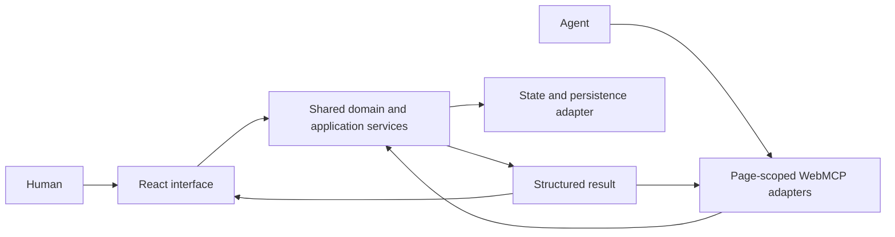

# ADR 0001: Shared UI and WebMCP boundaries

- Status: Accepted
- Date: 27 August 2026
- Story: [NEX-1153](https://linear.app/nexabyte/issue/NEX-1153/record-the-demo-architecture-and-page-scoped-webmcp-design)

## Context

Attendly-webMCP lets a person and an agent work with the same visible event state. It must remain a standalone, synthetic demonstration with no dependency on private Attendly code, services or customer data.

OpenAI's [Site tools guide](https://learn.chatgpt.com/docs/webmcp) says that site tools belong to the page providing them, should reuse the application's existing logic and permissions, and must not replace the normal human interface.

## Decision

1. **Keep one standalone application.** The existing React and Vite project remains the public interface and contains everything needed to run the demonstration.
2. **Share domain and application services.** Human controls and WebMCP handlers use the same services without sharing UI or adapter implementations. Components and tool adapters must not duplicate event, booking, attendance or accountability rules.
3. **Scope tools to visible context.** The active page or mode determines which tools are registered. Leaving that context removes tools that are no longer valid.
4. **Keep the human journey complete.** WebMCP is progressively enhanced through browser feature detection. Without it, all human journeys remain usable and the page shows a non-blocking compatibility explanation.
5. **Preserve the public safety boundary.** Only synthetic data is committed or persisted. Consequential actions remain reviewable, visible in the interface and described without implying certified life-safety behaviour.

## Context boundaries

| Visible context | Capability boundary |
| --- | --- |
| Public organisation and events | Public discovery, event details and reviewable booking |
| Organiser events | Event listing and reviewable event preparation |
| Event control room | Only operations for the selected event |
| Evacuation accountability mode | Only accountability operations for the active event |

Exact tool names, schemas, annotations and registration lifecycle belong to the WebMCP implementation stories.

## Consequences

- Future UI and WebMCP stories must introduce shared services before exposing the same behaviour through both interfaces.
- Tool availability is part of page state and requires transition and fallback tests.
- Agent results must update or be verifiable against the visible interface.
- This document is an architectural constraint, not a functional design specification.